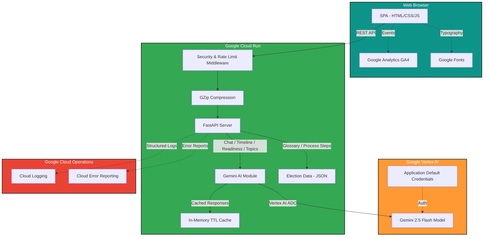

# BallotBox AI — Election Literacy & Voter Empowerment Platform

An interactive AI-powered platform that helps users understand election
processes, timelines, voter registration, and civic participation through
conversational AI — powered by **Google Gemini 2.5 Flash** and **Vertex AI**,
deployed on **Google Cloud Run**.

## Chosen Vertical

**Election Literacy & Voter Empowerment** — A non-partisan AI assistant that teaches
users about election mechanics, voting procedures, timelines, and civic
participation across global democracies with a focus on India.

## Architecture



## Google Services Integration

| Google Service             | Usage                                              |
| -------------------------- | -------------------------------------------------- |
| **Vertex AI (Gemini 2.5)** | Core AI — chat, timelines, readiness, topic explain |
| **Google Cloud Run**       | Serverless container hosting with auto-scaling      |
| **Google Cloud Logging**   | Structured JSON logging and monitoring              |
| **Google Analytics (GA4)** | User interaction tracking and engagement metrics    |
| **Google Fonts**           | Inter & JetBrains Mono typography                   |
| **Cloud Error Reporting**   | Automatic error capture and monitoring            |
| **Google Material Symbols** | Icon system for UI elements                       |
| **Application Default Credentials** | Secure keyless authentication for Vertex AI |

## Tech Stack

| Component   | Technology                   | Purpose                              |
| ----------- | ---------------------------- | ------------------------------------ |
| AI Model    | Gemini 2.5 Flash (Vertex AI) | Reasoning, generation, education     |
| Backend     | FastAPI (Python 3.11)        | REST API with Pydantic validation    |
| Frontend    | Vanilla HTML/CSS/JS          | Neo-Brutalist accessible SPA         |
| Auth        | Vertex AI ADC                | Application Default Credentials      |
| Deployment  | Google Cloud Run             | Serverless container hosting         |
| Logging     | Google Cloud Logging         | Structured production logging        |
| Analytics   | Google Analytics (GA4)       | User engagement and event tracking   |
| Fonts       | Google Fonts                 | Inter & JetBrains Mono              |
| Compression | GZip Middleware              | Response compression (>500 bytes)    |
| Caching     | In-memory TTL Cache          | Reduce redundant Vertex AI calls     |
| Security    | OWASP Headers + Rate Limit   | CSP, HSTS, XSS protection           |
| Errors      | Cloud Error Reporting        | Automatic exception capture          |
| Tracing     | Request ID Middleware        | UUID4 request tracing across logs    |
| Testing     | pytest + httpx + anyio       | Async API and unit tests             |

## Features

- **AI Chat** — Conversational assistant for election process questions
- **Election Process Guide** — Step-by-step visual walkthrough of how voting works
- **Timeline Generator** — AI-generated election timelines for any country
- **Voter Readiness Check** — Self-assessment quiz with AI-powered feedback
- **Election Glossary** — Searchable database of 25+ electoral terms
- **Non-Partisan** — Factual, neutral education without political bias
- **Accessible** — WCAG-compliant with keyboard navigation, ARIA labels, skip links
- **Responsive** — Mobile, tablet, and desktop optimised
- **Secure** — OWASP headers, CSP, rate limiting, input validation, XSS sanitization
- **Observable** — Request ID tracing, Cloud Error Reporting, structured logging
- **Keyboard Shortcuts** — Number keys 1-5 switch tabs, / focuses chat
- **Print-Friendly** — Clean print stylesheet for offline reference

## Project Structure

```
ballot_box/
├── main.py                 # FastAPI app factory with lifespan & middleware
├── config.py               # Centralized settings from environment variables
├── ai/
│   ├── __init__.py
│   └── gemini.py           # Vertex AI Gemini integration with caching
├── api/
│   ├── __init__.py
│   ├── routes.py           # REST API endpoints with Pydantic models
│   └── middleware.py       # Security headers, rate limit, request ID, error handler
├── services/
│   ├── __init__.py
│   ├── google_cloud.py     # Cloud Logging & Cloud Run metadata
│   ├── error_reporting.py  # Google Cloud Error Reporting integration
│   └── cache.py            # In-memory TTL cache for AI responses
├── data/
│   ├── glossary.json       # 25 electoral terms
│   └── election_process.json  # 7-step voting guide
├── static/
│   ├── index.html          # SPA with Google Analytics & Fonts
│   ├── styles.css          # Neo-Brutalist responsive CSS
│   └── app.js              # Frontend logic with GA event tracking
├── tests/
│   ├── conftest.py         # Shared fixtures
│   ├── test_api.py         # API endpoint tests
│   ├── test_ai.py          # AI module tests
│   ├── test_config.py      # Configuration tests
│   ├── test_middleware.py  # Security & performance tests
│   ├── test_security.py    # Input validation & edge cases
│   ├── test_cache.py       # TTL cache tests
│   └── test_error_reporting.py  # Error reporting tests
├── Dockerfile              # Production container (non-root user)
├── requirements.txt        # Python dependencies
├── pyproject.toml          # Project metadata & tool config
├── pytest.ini              # Test runner configuration
└── README.md
```

## Approach and Logic

1. **AI-First Design** — Every interactive feature (chat, timeline, readiness) is
   powered by Gemini 2.5 Flash via Vertex AI, providing intelligent, contextual
   responses rather than static content.

2. **Non-Partisan Architecture** — The system instruction enforces neutrality;
   the AI redirects partisan questions to factual process information.

3. **Performance Optimization** — In-memory TTL caching reduces redundant
   Vertex AI calls for identical queries. GZip compression minimises payload
   size. Static data (glossary, process) is loaded once via `lru_cache`.

4. **Security-First** — OWASP security headers (CSP, HSTS, X-Frame-Options),
   per-IP rate limiting, Pydantic input validation with size constraints,
   XSS sanitization in the frontend, and non-root Docker user.

5. **Observability** — Google Cloud Logging provides structured JSON logs.
   Cloud Error Reporting captures unhandled exceptions. Request ID tracing
   enables correlation across distributed logs. Google Analytics tracks
   user engagement. Response time headers enable performance monitoring.

## Assumptions

- Users have internet access to load Google Fonts and submit queries
- The Vertex AI API is enabled on the configured Google Cloud project
- ADC is configured (via `gcloud auth application-default login` locally
  or automatically on Cloud Run)
- The GA4 measurement ID (`G-BALLOTBOX01`) should be replaced with a
  real ID for production analytics

## Prerequisites

- Python 3.11+
- Google Cloud project with Vertex AI API enabled
- `gcloud` CLI installed and authenticated

## Local Development

```bash
cd ballot_box
pip install -r requirements.txt

export GOOGLE_CLOUD_PROJECT=your-project-id
export GOOGLE_GENAI_USE_VERTEXAI=TRUE
export GOOGLE_CLOUD_LOCATION=us-central1

uvicorn main:app --reload --port 8080
```

## Run Tests

```bash
pytest -v
```

## Deploy to Cloud Run

```bash
gcloud run deploy ballotbox-ai \
  --source . \
  --region us-central1 \
  --allow-unauthenticated \
  --set-env-vars="GOOGLE_GENAI_USE_VERTEXAI=TRUE,GOOGLE_CLOUD_PROJECT=your-project-id,GOOGLE_CLOUD_LOCATION=us-central1" \
  --memory 512Mi \
  --timeout 60
```

## API Endpoints

| Method | Path           | Description                         |
| ------ | -------------- | ----------------------------------- |
| GET    | /api/health    | Service health check                |
| POST   | /api/chat      | AI chat about elections              |
| POST   | /api/timeline  | Generate election timeline           |
| POST   | /api/readiness | Voter readiness self-assessment     |
| POST   | /api/topic     | AI explanation of electoral topic   |
| GET    | /api/glossary  | Full election glossary              |
| GET    | /api/process   | Step-by-step election process guide |
| GET    | /api/docs      | Interactive API documentation       |

## Security

- **Input validation** — Pydantic models with field constraints and custom validators
- **CORS** — Configurable allowed origins via environment variable
- **Security headers** — CSP, HSTS, X-Frame-Options, X-Content-Type-Options, XSS protection
- **Rate limiting** — Sliding-window per-IP rate limiter (60 req/min)
- **XSS prevention** — Frontend sanitization before innerHTML rendering
- **No hardcoded credentials** — Uses Application Default Credentials (ADC)
- **Non-root container** — Docker runs as unprivileged `appuser`
- **Cache-Control** — `no-store` on API responses to prevent sensitive data caching
- **Request ID tracing** — UUID4 per-request for distributed log correlation
- **Global error handler** — Safe JSON errors, no stack trace leakage
- **Cloud Error Reporting** — Automatic exception capture in production

## License

MIT
